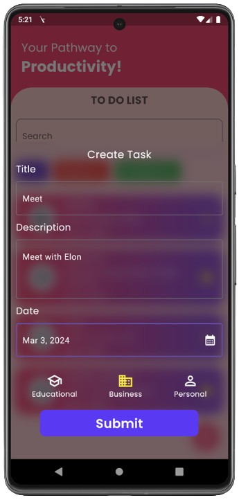

# ToDo App (Intermediate)

## Welcome to the ToDo app! 
This app is designed to help you organize your tasks efficiently. With features like task creation, editing, deletion, searching, and categorization into completed, ongoing, and all tasks, managing your to-dos has never been easier.

## Features

- **Task Management:** Create, edit, and delete tasks effortlessly.

- **Local Database (Sqflite):** Utilizes Sqflite for efficient local data storage.

- **Categorization:** Tasks are categorized into three sections: completed, ongoing, and all tasks.

- **Search:** Easily find tasks by searching with keywords.

## Screenshots

